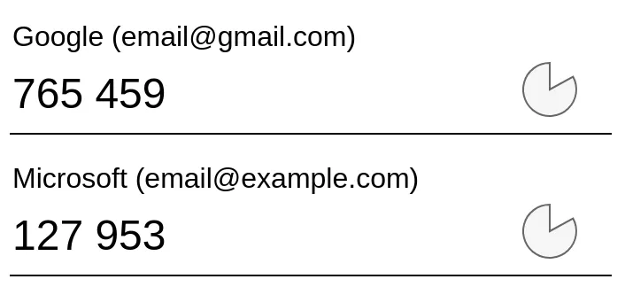
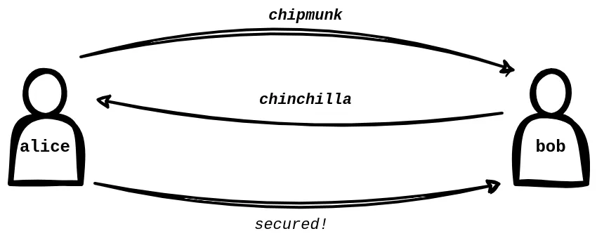
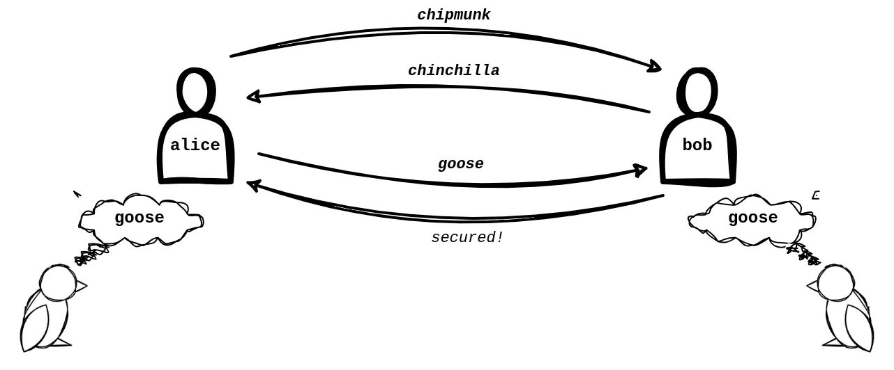
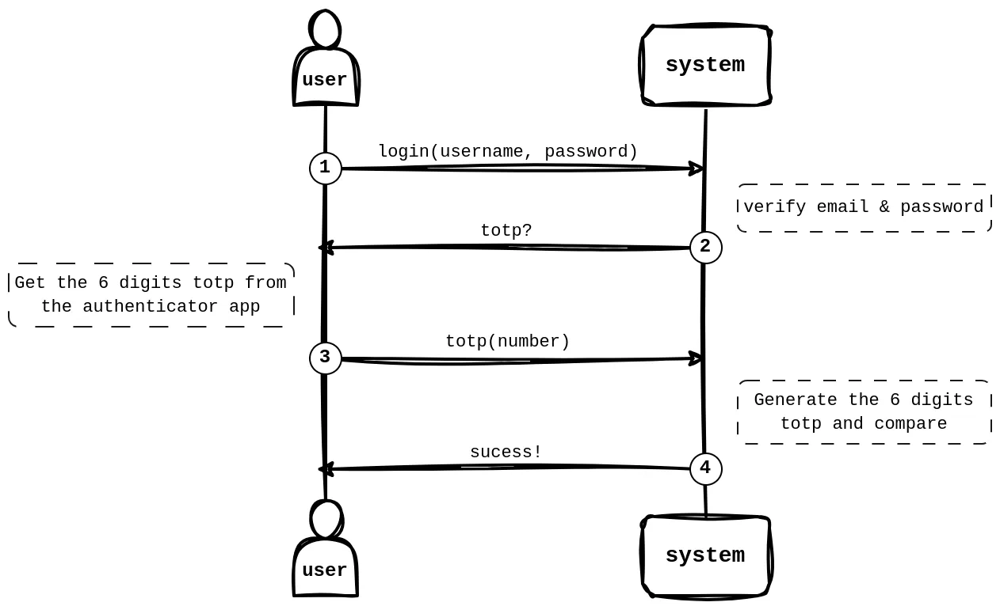

# How does multifactor authentication (MFA) work?

What is that 6 digits number in the authenticator app? Why those numbers change
every 30 seconds? How are they generated? How does the server know that this is
the correct number? How does it work offline?

Also, why do we need to scan a QR code when setting it up? What does the QR code
contains? How secure is the whole system? What are the limitations? What to
consider if implementing a server to support this authentication method?

We will start with a some simple intuitive explanation and slowly go into the
technical details and algorithms. Hopefully you can answer all the above
questions after reading this. This is not a high level explanation of why it's
good to have MFA, or how to deploy it, there are
[plenty](https://www.microsoft.com/en-us/security/blog/2020/01/15/how-to-implement-multi-factor-authentication/)
[of](https://www.cyber.gov.au/resources-business-and-government/maintaining-devices-and-systems/system-hardening-and-administration/system-hardening/implementing-multi-factor-authentication)
[resources](https://www.okta.com/resources/whitepaper/8-steps-for-effectively-deploying-mfa/)
[explaining](https://auth0.com/blog/multifactor-authentication-mfa/) that
already. This article focus on the details of the technology under the hood.

<!-- truncate -->

If you are ready, let's get started. First, we need to understand what is a
factor means in multifactor authentication.

## What is a "factor"?

A factor is like a key for a different kind of locks. Imagine a door has only 1
lock, then everyone who has the key to that lock can open the door. Multifactor
is like having multiple locks on the doors that require different keys. Even if
you lost 1 key accidentally, the door is still locked.

In digital systems, usually the lock is the username and password. If this is
the only factor, if someone can steal or guess your password, then your account
is compromised. If there is an extra factor, usually in a different format, like
authenticator app or a separate physical security key, then your account will be
secure even if your password is leaked.

In [a study conducted by Microsoft in 2023](https://arxiv.org/abs/2305.00945),
MFA reduces the risk of being compromised by 99.22%! Also, dedicated
authenticator app like Microsoft Authenticator outperform SMS-based
authentication.

## Time-based one-time password (TOTP)

This article will focus on explaining these authenticator apps, the one you see
6 digits number changing every 30 seconds. It is called time-based one-time
password, TOTP in short. We will know how does the TOTP algorithm generate that
6 digits number, why does it change every 30 seconds, how does the server know
the same 6 digits number even if the authenticator app is offline.



The formal document that defines how TOTP should work is defined in
[RFC 6238](https://datatracker.ietf.org/doc/html/rfc6238). TOTP is a way to
generates a user-friendly value based on the current time, called the one time
password (OTP), to authenticate the user. The one time password is used once
only and cannot be reused. But before we go deep into the terminologies and how
all these work, let's look at a simpler, imaginative scenario to understand the
idea behind TOTP. Let's imagine we need to secure a phone call.

## Explain like I am five

Imagine Alice and Bob phone call each other to share updates and secrets, but
they are often scared that the phone is not picked up by one of them but
Mallory, so they both come up with a secret phrase, "chipmunk" and "chinchilla".
Every time before the phone call starts, Alice and Bob need to tell their secret
phrase. Only if both sides are correct, they start talking. It works well until
one time Bob realize Mallory is listening from behind and hear the secret phrase
"chinchilla", what can they do?



Turns out, there is a special species of magic parrot. The magic parrots are
always twin. At any given time, you can ask the magic parrot to say a random
word. The two magic parrots will say the same word even if they are physical
separated far away.



Now, as long as Alice and Bob keep their magic parrot secure to them, they are
safe. Even if Mallory knows the secret phrase "chipmunk" or "chinchilla", she
cannot impersonate Alice and Bob because she doesn't have that specific magic
parrot. She cannot reuse "goose" either because this word is randomly generated
by the magic parrot and used once only.

If you understand why the magic parrot makes it more secure, then you know why
TOTP makes authentication systems more secure. The magic parrot is the second
factor. In TOTP, "chipmunk" or "chinchilla", is your username and password. And
"goose" is the TOTP, the generated one-time password. The magic parrot is the
TOTP algorithm. It can generate a random value at any given time.

In the real world, there is no magic parrot twins that work like this, but we
can create something digitally that works in the same way.

## TOTP in detail

This is the typical flow of an authentication with TOTP.



1. The user first login with username and password, or any other authentication
   methods like
   [single signed-on (SSO)](https://en.wikipedia.org/wiki/Single_sign-on)
2. The server verifies the identity and confirm that the user has enabled
   multifactor authentication, so the server requests the user to provide the
   TOTP
3. The user get the TOTP from where it is stored, e.g. authenticator app or
   password managers, and submits it
4. The server also generates the TOTP from its end and compare the two is the
   same

We are going to focus on step 3 and 4, particularly how the user and the server
are able to generate the TOTP without communicating at that point.

To understand how TOTP is generated and why it is secure, we need to know three
basic ingredients. A hash function, the Unix timestamp and a shared secret
between the server and the user.

### Hash functions

[Hash functions](https://en.wikipedia.org/wiki/Hash_function) in short are any
one-way function that can map any data into another fixed size value. It has a
few key properties that you need to keep in mind:

1. Given the same data, it will always generate the same hash
2. Given a different set of data, it will always generate a different hash
3. When given a hash, it’s impossible to guess or know what is the data that
   generated this hash

Based on the first two properties, hash functions should never collide. The
number of bits in a hash is large, usually 256 or above. At that scale, a
collision is extremely unlikely. If you don't believe this work you may watch
[this video from 3blue1brown on how secure is 256 bits](https://youtu.be/S9JGmA5_unY)
or read about the
[birthday problem](https://en.wikipedia.org/wiki/Birthday_problem).

Hash functions should also be one-way. One intuitive way to understand one-way
function is multiplication and factoring. Multiplying two numbers together is
kind of like "one-way". It is relatively easy to calculate 89 × 67 = 5963, I
believe you can do it with a pen and paper in a minute. But if only 5963 is
given, and you were asked to find out which two numbers multiply to 5963, it's
way harder. Hope this can convince you there are such one-way, irreversible
mathematical operations exist. They aren't absolutely impossible to reverse,
just way harder.

### Unix time

The second basics we need to understand is there is a globally universal
timestamp. Even though your computer might be disconnected from the internet, as
long as it has battery and the clock is correct, all computers should share the
same timestamp.

In computers, there is a standard way to define the time, which is the
[Unix time](https://en.wikipedia.org/wiki/Unix_time). That is the number of
seconds since 00:00:00 UTC on 1 January 1970. There are some quirks and
exceptions (e.g. leap seconds), but all computers should be able to calculate
the same Unix time at any given moment.

The timestamp is the important let the server and user generates the TOTP code
separately without communication to each other.

### Shared secret

The last but not least is there is a shared secret only know by the server and
the user. When you use the authenticator app to scan a QR code to register the
multifactor authentication, that is when the shared secret is exchanged.

The shared secret should not be revealed after the initial exchange. The shared
secret should be random, unique for each user, and has a high
[entropy](<https://en.wikipedia.org/wiki/Entropy_(information_theory)>) that
it's not possible to be guessed or brute forced.

In the authenticator app example, the authenticator app gets the shared secret
from the QR code and stores it, which usually is just random bytes of human
unreadable data. The server also stores a copy of the secret uniquely linked to
this user.

Now we go to the actual algorithm.

### TOTP algorithm

The TOTP algorithm works like this:

1. Using a hash functions to hash the shared secret recursively
2. Using the current timestamp to determine how many times to hash
3. Calculate the modulus of the hash based on the size of the TOTP, this gives a
   human-readable 6 digits number

You can read more of the detail algorithm in
[section 4](https://datatracker.ietf.org/doc/html/rfc6238#section-4) of the RFC,
which is based on top of the HMAC-based One-Time Password (HOTP) algorithm
defined in [RFC 4226](https://datatracker.ietf.org/doc/html/rfc4226).

The hash function used as specified in the RFC 6238 should be
[SHA-256 or SHA-512](https://en.wikipedia.org/wiki/Secure_Hash_Algorithms). This
is also agreed and stored in the authenticator app when scanning the QR code.
Because hash functions generate different value given different input, without
knowing the shared secret, it is impossible to generate the same number. This is
the reason why at any given time, there is only 1 valid number for this user,
and the server is able to verify that. Also, because hash functions are one-way,
even if the TOTP code is exposed, it is not possible to guess the shared secret
unless brute force.

In this algorithm, the timestamp used is not the exact Unix time, otherwise the
6 digits number will change every second. It will be impractical to ask a user
to enter 6 digits and submit within a second. The longer the time before
changing the number, the better the usability for the users, because it's less
likely the number changed midway when the user is inputting it. But the longer
it is, the less secure it is, because there is a larger window that the TOTP is
exposed. It's always a trade-off. The RFC 6238 recommends a time step of 30
seconds, which means the number only change every 30 seconds. If you open your
authenticator app now, and reference a clock, you should see the number
refreshes at the 00 or 30 seconds mark in a minute, unless it is not using 30
seconds as the time step.

As you can see, even if the authenticator app is offline and there is no
communication between your phone and the server, both of them can generate the
same 6 digits number.

### Resynchronization

It is possible that there are delays in the network connection, or the clock on
the user device is delayed, or the user input the number too slow. As such, the
RFC recommends the validation server support resynchronization. For example, the
current and the last 2 TOTP generated are all valid. The number of steps
backward to consider valid is again a trade-off between usability and security.
The server may optionally record the drift that the user clock has and adjust
for that in future validations.

## Security Considerations

There are various best practices for TOTP to be secure.

First, the user must keep their TOTP secret a secret. It is assumed that the
secret is securely stored in authenticator app or password manager. That should
not be accessible over the internet. Therefore,
[it is controversial](https://news.ycombinator.com/item?id=35708869) when Google
Authenticator supports syncing and backing up secrets to Google.

All communications between the user and the server should be done over a secure
channel, e.g. HTTPS. It is true that revealing the TOTP will not leak the shared
secret, but it's best to not leak it at all. The initialization phase must be
communicated over secure channel. If the initial setup QR code is leaked, the
attacker has access to the shared secret and the attacker can always generate
the TOTP.

The TOTP code should also be used once only, as specified in the name, one-time
password. For example, if the user login to the account using a TOTP code, that
code should not be valid any more. This is to prevent an attacker that has
access to the newly sent TOTP code from reusing that code to gain access. The
user must wait for 30 seconds for the next code to be generated to log in.

Given all these practices, the best possible attack against this system should
just be brute forcing to guess the shared secret. And as mentioned, the shared
secret should be long enough that it's not possible to guess and brute force in
reasonable timeframe.

TOTP is still vulnerable to phishing attacks. Say the user is logging into a
fake authentication website, or willing transferring the generated TOTP to
attackers. Attackers can then proxy or input the TOTP code in real time to gain
access to the system.

## Implementation Details

There are two things to set up for the server. Initializing the TOTP and
authentication the TOTP.

### Setting up TOTP

When a user set up TOTP, the server usually provides a QR code. It is the
easiest way and foolproof way to exchange the shared secret. The user can use a
separate device to get the secret without the need to copy and paste. Most
phones have a camera nowadays, and password manager browser extensions (e.g.
[1Password](https://support.1password.com/one-time-passwords/)) can scan QR
codes as well. QR codes have error correction by default and since users do not
need to type in the unreadable secret, making it less likely to make mistakes.

The QR code is usually a URL in the format of

```
otpauth://totp/<issuer>:<account>?secret=<RandomBytesOfData>
```

- `otpauth` is the scheme
- `totp` is the type of OTP that we are using
- The issuer is usually the organization, e.g. Google, Microsoft
- The account is usually your username or email
- The secret must be present in the parameters, usually a long string
- There are optional parameters like `algorithm` for the hash function used,
  `period` which defaults to 30 as mentioned above, and `digits` for the number
  of digits in the OTP code, which is usually 6
- You can read more about the URL format of TOTP in
  [this page](https://docs.yubico.com/yesdk/users-manual/application-oath/uri-string-format.html)

Before the user account has MFA enabled, the server should ask for a TOTP code
to verify that the user correctly saved the shared secret. Only if that code is
valid, MFA is successfully enabled. The server needs to handle the state where
the shared secret is generated and stored, but the MFA is not enabled yet.

### Recovery Codes

In practical use, it is possible that users lose access to their phone or
wherever the TOTP codes are generated. It is a challenging aspect because the
easier it is for a user to recover the account after failed to log in with MFA
means the easier it is for attacker to use the same method to compromise the
account.

One way to recover the account is the server provides some single-use recovery
codes, usually some longer random strings. They are usually shown to the user
once after the MFA is first successfully enabled. Each recovery codes should
only be used once only, same as how TOTP codes can only be used once to prevent
replay by an attacker.

During authentication, the system should allow the user to input recovery codes
and if matches, the user is logged in but that recovery code is invalidated. The
users are responsible for keeping the recovery codes secure and use it only when
TOTP codes are not available.

Alternative recovery methods includes

- Mailing a one-use recovery codes to the user
- Require the user to contacting the support team to verify the identity before
  resetting the MFA
- Require users to set up multiple MFA to limit the likelihood of losing access
  to all methods at once

### Authenticating TOTP

Before supporting MFA, the login endpoint of the server will either return login
success or login failed. With TOTP supported, the server has a third response,
indicating the credentials are valid but a TOTP code is required because MFA is
enabled.

In this response, the server should also return a unique token, (e.g. a JWT
token) to the frontend. This token will expire in a short period of time, like 5
minutes. It has to be submitted to a separate TOTP validation endpoint together
to signal that this particular user already passed the username & password
validation in a previous step. The server use this token to determine which user
is trying to log in and which TOTP shared secret to use to validate the TOTP
code submitted. Without this step, a user can just log in with a TOTP code in
the TOTP endpoint without even having the password validation step, which means
the system is back to single factor authentication. Another option is the
frontend stores the previously inputted username and password, and submit that
to the server alongside the TOTP code.

### Libraries and third party service

Knowing how the algorithm works behind the scenes is great, but you should never
implement the algorithms yourself. Use a library instead. For example,
[`otpauth`](https://www.npmjs.com/package/otpauth) in the NPM registry for Node,
Deno, Bun runtime in JavaScript.

There are also third party services that provide authentication or MFA as a
service. It is good for applications that do not have resources to implement
their own authentication system, but also require careful consideration for the
security, integrity and availability of the third party service.

## Useful links

- [OWASP Multifactor Authentication Cheat Sheet](https://cheatsheetseries.owasp.org/cheatsheets/Multifactor_Authentication_Cheat_Sheet.html)
- [RFC 6238 TOTP: Time-Based One-Time Password Algorithm](https://datatracker.ietf.org/doc/html/rfc6238)
- [Wikipedia: Multi-factor Authentication](https://en.wikipedia.org/wiki/Multi-factor_authentication)
- [Wikipedia: Time-based One-time Password](https://en.wikipedia.org/wiki/Time-based_one-time_password)
