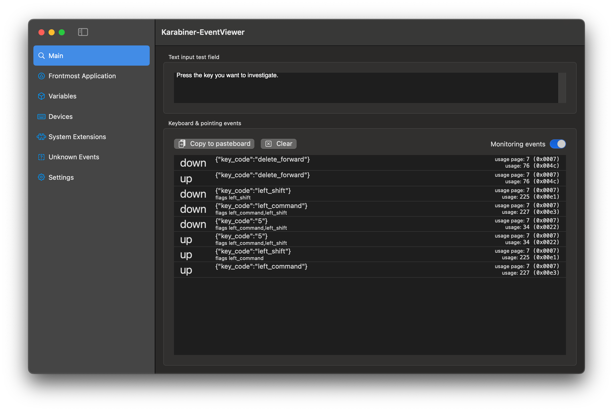

A couple of months ago, I got a MacBook Pro. The first thing I need to do is to
remap the keyboard,
[just like what did I with my Ubuntu laptop using keyd](./2024-09-08-keyd.md).
Once again, I realize the `CapsLock` is not useful enough for it to earn this
precious place. I keep accidentally pressing the `CapsLock` key, thinking it
will work like a `Control` key in Windows/Ubuntu. This post is about how I try
to replicate the setup I had in [keyd](./2024-09-08-keyd.md) to Mac with
[Karabiner-Elements](https://karabiner-elements.pqrs.org/). I will show you how
to

- Create custom forward delete
- Using `z + h/j/k/l` as arrows
- Switch between chosen apps with `z + <number>`
- Make `CapsLock` useful again by mapping it to multiple modifier keys, etc.

Spoiler, I underestimated the complexity it can get.

<!-- truncate -->


_[xkcd 1806: borrow your laptop](https://xkcd.com/1806/)_

_In reality, there are very few situations where my configuration would make_
_my keyboard unusable by other people. You'll see below._

## Keys that I Need to Remap

[In my post about keyd](./2024-09-08-keyd.md), I shared what configurations I
have on my Ubuntu laptop. Unfortunately, not all of it can be converted to Mac
the way I want. I listed down what I need the most.

- `z + h/j/k/l` function as arrow keys
- `CapsLock` mimic what I had for the `CapsLock` in Windows/Ubuntu
  - Function as `Cmd` for things like open/close tab, copy and paste, etc.
  - Function as `Ctrl` for things like `Ctrl + d`, `Ctrl + u` in Vim
  - Function as `Opt` for backspace, like `Ctrl + backspace` that backspace a
    word
  - Function as `Esc` when pressed alone

There are also configurations that I specifically added because of Mac.

- `=` + `Delete` is the real `Delete`, deleting the character after the cursor
- `z + <num>` will open apps

In Mac, the `Delete` key is just backspace and there is no `Delete` key in the
layout. I added `=` and `Delete` press simultaneously works as a delete key
being pressed. And for the rest of the post, I will call the key labelled as
`Delete` on the keyboard as `Backspace`.

In Windows or Ubuntu, I can use `Win + <num>` to open apps that I pinned to the
dock. For example, Win+1 is always the terminal, Win+2 is the browser, etc. And
I can configure 10 apps that I frequently need and quickly switch between them
without the need to loop through `Alt+Tab`. However, surprisingly, Mac does not
have this feature! With that, I mapped `z + <num>` to apps that I frequently use
and switch between them.

In the [keyd post](./2024-09-08-keyd.md), I shared a few more shortcuts for
windows management, audio playback and shortcut strings, but I don't need those
any more. Either Mac supports them well enough, or I really don't use them now.
For example, the media play / pause / forward / backward comes by default in the
media keys row on the Mac keyboard.

I choose [Karabiner-Elements](https://karabiner-elements.pqrs.org/) because I
learned about it long time ago, even before I started remapping my keyboards.
Back then, I was not using a Mac, so I started with
[AutoHotkey](https://www.autohotkey.com/) on Windows and
[keyd](https://github.com/rvaiya/keyd) in Ubuntu. Now I got my hands on a Mac, I
did not consider other alternatives before choosing Karabiner.

This post goes through my configurations in Karabiner one by one. All of my
configurations are complex modifications in the Karabiner-Elements app.


Throughout the blog, if you find anything not working, the
[Event Viewer](https://karabiner-elements.pqrs.org/docs/manual/operation/eventviewer/)
is super helpful to debug and display what keys are pressed, the states of the
variables, etc.



## The `z` Key

Let's start with the simpler modifications around the `z` key. I started using
`z` as my extra modifier (called layer in `keyd`) ever since I started remapping
my keyboard. The `z` key is rarely used, meaning I can overload it without
noticeable inconvenience. If you are new to this idea, you can think of `z` as
another `Shift` key. The `Shift` key gives your whole keyboard another layer on
hold, and I just make the `z` key do the same.

### Arrow Keys

I do not like to move my palm to find the arrow keys. I am used to pressing the
`z` key as the modifier and use `hjkl` as the four arrow keys. `hjkl` references
the four direction in Vim, where `h` is left, `j` is down, `k` is up, and `l` is
right.

For our first rule, navigate to the complex configurations tab in
Karabiner-Elements and add a new rule. First, we give a description and set a
variable with the
[`to.set_variable`](https://karabiner-elements.pqrs.org/docs/json/complex-modifications-manipulator-definition/to/set-variable/)
function to indicate the `z` key is held.

```json
{
  "description": "z + hjkl for arrow key",
  "manipulators": [
    {
      "from": {
        "key_code": "z",
        "modifiers": { "optional": ["any"] }
      },
      "to": [{ "set_variable": { "name": "z_pressed", "value": 1 } }],
      "to_after_key_up": [
        { "set_variable": { "name": "z_pressed", "value": 0 } }
      ],
      "to_if_alone": [{ "key_code": "z" }],
      "type": "basic"
    }
  ]
}
```

Manipulators in Karabiner are applied in the order that they are defined, from
the top to the bottom. This first manipulator defines 3 things when the `z` key
is pressed (`from`):

1. ([`to`](https://karabiner-elements.pqrs.org/docs/json/complex-modifications-manipulator-definition/to/))
   when `z` is pressed, set the variable `z_pressed` to 1
2. ([`to_after_key_up`](https://karabiner-elements.pqrs.org/docs/json/complex-modifications-manipulator-definition/to-after-key-up/))
   when `z` is released after press, set the variable `z_pressed` to 0
3. ([`to_if_alone`](https://karabiner-elements.pqrs.org/docs/json/complex-modifications-manipulator-definition/to-if-alone/))
   when `z` is pressed and released without another key is being pressed, output
   `z`

The `z_pressed` variable is what makes `z` behaves like a `modifier`. Notice
that the third rule, `to_if_alone`, is important. Otherwise, we lost the `z`
key.

Then, based on the `z_pressed` variable, modify the `hjkl` to output the arrow
keys when `z` is pressed using
[`conditions.variable_if`](https://karabiner-elements.pqrs.org/docs/json/complex-modifications-manipulator-definition/conditions/variable/).
For example, only when `z_pressed` is true, remap `j` to `down_arrow`:

```json
{
  "description": "z + hjkl for arrow key",
  "manipulators": [
    // others ...
    {
      "conditions": [
        { "name": "z_pressed", "type": "variable_if", "value": 1 }
      ],
      "from": {
        "key_code": "j",
        "modifiers": { "optional": ["any"] }
      },
      "to": [{ "key_code": "down_arrow" }],
      "type": "basic"
    }
    // similar for k, h, and l for up, left, and right respectively
  ]
}
```

### Opening Apps

This is something I added in Mac, I want to use the `z + <num>` combination to
open specific apps, like what I can do in Windows/Ubuntu that opens apps that
are pinned to the dock with `Win + <num>`.

We can reuse the `z_pressed` variable across different rules. For the `to`
event, we can use
[`software_function.open_application`](https://karabiner-elements.pqrs.org/docs/json/complex-modifications-manipulator-definition/to/software_function/open_application/)
and supply a file path.

Here is a sample configuration for mapping `z + 1` to open iterm2.

```json
{
  "description": "Open apps by z + num",
  "manipulators": [
    {
      "conditions": [
        { "name": "z_pressed", "type": "variable_if", "value": 1 }
      ],
      "from": {
        "key_code": "1",
        "modifiers": { "optional": ["any"] }
      },
      "to": [
        {
          "software_function": {
            "open_application": { "file_path": "/Applications/iTerm.app" }
          }
        }
      ],
      "type": "basic"
    }
    // Many others
  ]
}
```

I have `z + 2` as my browser, `z + 3` for slack, `z + 4` for Notion, etc. You
can define what apps you would like to set for each key. On Mac, usually you
will be able to find the file path of an application in the `/Applications`
folder.

### More Shortcuts

I added a few more shortcuts with the `z` key, this includes:

- `z + v` to `Command + Shift + v` for paste without formatting
- `z + p` to `Command + Shift + p` for command prompt in VS Code
- `z + slash` to `Command + Shift + slash` for the Help Menu on the menu bar

Here is one example for `z + v` to `Command + Shift + v`. You can add multiple
modifier keys in the to list.

```json
{
  "conditions": [{ "name": "z_pressed", "type": "variable_if", "value": 1 }],
  "from": {
    "key_code": "p",
    "modifiers": { "optional": ["any"] }
  },
  "to": [
    {
      "key_code": "p",
      "modifiers": ["left_command", "left_shift"]
    }
  ],
  "type": "basic"
}
```

At last, same as what I did in Ubuntu `keyd`, I remapped `z+i` and `z+o` back to
`zi` and `zo` because it is common to type `zi` and `zo` together when typing
fast and then the `z` key is captured and missed. For me, they are the two most
common characters following `z`.

```json
{
  "description": "z + hjkl for arrow key",
  "manipulators": [
    // others ...
    {
      "conditions": [
        { "name": "z_pressed", "type": "variable_if", "value": 1 }
      ],
      "from": {
        "key_code": "i",
        "modifiers": { "optional": ["any"] }
      },
      "to": [{ "key_code": "z" }, { "key_code": "i" }],
      "type": "basic"
    }
    // similar for o
  ]
}
```

I will share the full karabiner configs below at the end.

## `= + Delete`

In Windows or Ubuntu, there are `Backspace` and `Delete`. `Backspace` removes
the character on the left (backward) of the cursor, while `Delete` removes the
right (forward).

In Mac, the `Delete` key is actually backspace and there is no `Delete` key. I
find it inconvenient, and it looks like it is a common modification in Karabiner
to remap `=` and `Delete` pressing simultaneously to be the actual `Delete`,
using the
[`from.simultaneous`](https://karabiner-elements.pqrs.org/docs/json/complex-modifications-manipulator-definition/from/simultaneous/)
function.

```json
{
  "description": "Change equal+delete to forward_delete if these keys are pressed simultaneously",
  "manipulators": [
    {
      "from": {
        "modifiers": { "optional": ["any"] },
        "simultaneous": [
          { "key_code": "equal_sign" },
          { "key_code": "delete_or_backspace" }
        ]
      },
      "to": [{ "key_code": "delete_forward" }],
      "type": "basic"
    }
  ]
}
```

## Remapping `CapsLock`

Now we get into the complicated part!

As mentioned above, I am used to `CapsLock` mapping to `Ctrl` in Windows or
Ubuntu. There is only `Ctrl` key in Windows / Ubuntu, and it is the most used
modifier key for me. Mapping `CapsLock` to `Ctrl` makes my left pinky feels so
much better. However, there are `Command` and `Ctrl` on Mac, I need to choose
which one to map to.

**`Command`**: The placement for `Command` in Mac is not bad. I can easily do
`Command+C`, `Command+V` with left thumb pressing `Command`. I can learn to use
my thumb to press `Command` related shortcuts. However, I still use my Ubuntu
laptop and I find it weird that I accidentally press the `Alt` key because of
the habit of using `Command` in mac. I want the shortcuts to be as consistent as
possible across all machines I use. As such, for most of the time, I still remap
`CapsLock` to `Command` on the Mac, and so the placement of shortcuts like copy
and paste remains consistent.

**`Control`**: However, there are times that I need the `Ctrl` key more than the
`Command` key on Mac. For example, I often need `Ctrl+C` to stop a process in
the terminal, or `Ctrl+U` and `Ctrl+D` to move up and down in Vim mode in text
editors. I am used to expecting the `CapsLock` key to work as a `Ctrl` in those
cases. Therefore, for the terminal and some text editors, I map `CapsLock` to
`Ctrl` key.

**`Option`**: To make it even more complicated, when I do
`CapsLock + Backspace`, I want it to function like `Ctrl + Backspace` in
Windows/Ubuntu, which deletes 1 word at a time. For me, backspace a word
(`Option + Backspace`) is more common than backspacing a line
(`Command + Backspace`). So I want `CapsLock` to be `Option` when it is used
with `Backspace`. And similarly, I want `CapsLock` to be `Option` when I do the
`= + Backspace` for forward deleting a word.

**`Escape`**: Last but not least, map `CapsLock `to `Escape` when pressed alone.
In summary, I am mapping `CapsLock` to `Command`, `Ctrl`, `Option` when it is
pressed with another key, depending on the scenario, and map it to `Escape` when
pressed alone.

I am overloading `CapsLock` so much because it is in such a comfortable position
in a standard QWERTY keyboard and I want to maximize its functionality, and at
the same time create a very similar functionality compare to the `Ctrl` key in
Windows/Ubuntu.

### The `CapsLock` Variable

After a lot of investigation and experimentation, to be able to remap the
`CapsLock` key to multiple modifier keys depending on the second key in the
combination, I must use a variable. I need to wait until the second key is
pressed to know which key the `CapsLock` to map to. I cannot simply remap
`CapsLock` to another modifier key when it is pressed.

For example, if I remap `CapsLock` to `Command` when `CapsLock` is pressed, then
it will always be `Command + ` something when I hold down `CapsLock`. When I
press `Backspace` it will be `Command + Backspace`, which I don't want. I cannot
"lift" the `Command` key when `Backspace` is pressed, and change it to
`Option + Backspace` instead.

What I can do instead, is define a `caps_lock_is_held` variable like the
`z_pressed` variable demonstrated above, and depending on which key is pressed,
conditionally add a modifier to the key pressed. If it is a `Backspace`, we do
`Option + Backspace`. If it is another key, we do `Command + <key>`. To
conclude, when `CapsLock` is being held, no modifier is triggered. Only when
another key is pressed, a modifier is being added conditionally. This gives the
flexibility we want.

And lastly, when `CapsLock` is pressed alone, map it to `Escape`. The
configuration looks like this:

```json
{
  "description": "CapsLock",
  "manipulators": [
    {
      "from": {
        "key_code": "caps_lock",
        "modifiers": { "optional": ["any"] }
      },
      "to": [
        { "set_variable": { "name": "caps_lock_is_held", "value": true } }
      ],
      "to_after_key_up": [
        { "set_variable": { "name": "caps_lock_is_held", "value": false } }
      ],
      "to_if_alone": [{ "key_code": "escape" }],
      "type": "basic"
    }
  ]
}
```

:::tip

Please note that we only need to use variable because we want to map a single
key to a different modifier key depending on the second key. If the modifier key
is always consistent, we can map the `CapsLock` key with a simple `from` `to`
manipulators. For example:

```json
{
  "description": "CapsLock to Command/Escape",
  "manipulators": [
    {
      "from": {
        "key_code": "caps_lock",
        "modifiers": { "optional": ["any"] }
      },
      "to": [{ "key_code": "left_command" }],
      "to_if_alone": [{ "key_code": "escape" }],
      "type": "basic"
    }
  ]
}
```

I started with this configuration, but only when I am not satisfied I created
more and switched to using variables. There are drawbacks for using variables,
which I will explain below.

:::

### `CapsLock` as `Option`

First, we start with the simplest. Remapping `CapsLock + Backspace` to
`Option + Backspace`.

```json
{
  "description": "CapsLock",
  "manipulators": [
    // Other manipulators
    {
      "conditions": [
        { "name": "caps_lock_is_held", "type": "variable_if", "value": true }
      ],
      "from": {
        "key_code": "delete_or_backspace",
        "modifiers": { "optional": ["any"] }
      },
      "to": [
        {
          "key_code": "delete_or_backspace",
          "modifiers": ["left_option"]
        }
      ],
      "type": "basic"
    }
  ]
}
```

This configuration specifies if the `caps_lock_is_held` variable is true, and
the backspace key is pressed, output the backspace key with the left option
modifier.

### `CapsLock` as `Control`

In some apps, I would like to use `CapsLock` as `Control`, so that I can do key
combinations that I am used to. Karabiner supports conditionally apply
manipulators by the applications using
[`frontmost_application_if`](https://karabiner-elements.pqrs.org/docs/json/complex-modifications-manipulator-definition/conditions/frontmost-application/).
It identifies an application by the bundle identifiers or the file paths. The
list of keys I remapped is mostly Vim key bindings or shortcuts in the terminal.
The following example is for mapping `CapsLock + c` to `Control + c`.

```json
{
  "description": "CapsLock",
  "manipulators": [
    // Other manipulators
    {
      "conditions": [
        { "name": "caps_lock_is_held", "type": "variable_if", "value": true },
        {
          "bundle_identifiers": [
            "^com\\.googlecode\\.iterm2$",
            "^com\\.jetbrains\\.rider$",
            "^com\\.google\\.android\\.studio$"
          ],
          "file_paths": ["/Applications/Cursor.app/Contents/MacOS/Cursor"],
          "type": "frontmost_application_if"
        }
      ],
      "from": {
        "key_code": "c",
        "modifiers": { "optional": ["any"] }
      },
      "to": [
        {
          "key_code": "c",
          "modifiers": ["left_control"]
        }
      ],
      "type": "basic"
    }
  ]
}
```

What this rule defines is if the app is iTerm2, Rider, Android Studio or Cursor,
`CapsLock + c` becomes `Control + c`. I did the same for
`["a", "c", "d", "o", "r", "u", "v"]`.

### `CapsLock` as `Command`

For all the remaining scenarios, I want `CapsLock` to function as `Command`.
Karabiner provides a way to remap any key by doing
[`from.any`](https://karabiner-elements.pqrs.org/docs/json/complex-modifications-manipulator-definition/from/any/)
key code. Unfortunately,
[it does not support returning what is that any key being captured](https://github.com/pqrs-org/Karabiner-Elements/issues/3580).
We cannot conveniently do from `CapsLock + any` to `Command + any`, and
Karabiner substitutes the "any" in.

Therefore, as you might have thought on when writing the rules above, I need to
use a script to generate all the combinations. Here is a sample manipulator for
the key `a`, to map `CapsLock + a` to `Command + a`:

```json
{
  "conditions": [
    { "name": "caps_lock_is_held", "type": "variable_if", "value": true }
  ],
  "from": {
    "key_code": "a",
    "modifiers": { "optional": ["any"] }
  },
  "to": [
    {
      "key_code": "a",
      "modifiers": ["left_command"]
    }
  ],
  "type": "basic"
}
```

I wrote a python script to generate this rule for every single key I need on the
keyboard:

```py
def set_command_key(data, key_code):
    data["manipulators"].append(
        {
            "conditions": [
                {"name": "caps_lock_is_held", "type": "variable_if", "value": True},
            ],
            "from": {"key_code": key_code, "modifiers": {"optional": ["any"]}},
            "to": [{"key_code": key_code, "modifiers": ["left_command"]}],
            "type": "basic",
        }
    )

def generate_rule():
    # some more code

    command_keys = (
        [chr(i) for i in range(ord("a"), ord("z") + 1)]
        + [chr(i) for i in range(ord("0"), ord("9") + 1)]
        + [
            "grave_accent_and_tilde",
            "hyphen",
            "equal_sign",
            "tab",
            "open_bracket",
            "close_bracket",
            "backslash",
            "semicolon",
            "quote",
            "return_or_enter",
            "comma",
            "period",
            "slash",
            "spacebar",
            "left_arrow",
            "right_arrow",
            "up_arrow",
            "down_arrow",
        ]
    )
    for key in command_keys:
        set_command_key(data, key)
```

What this script does is for all the keys from `a` to `z`, plus all keys from
`0` to `9`, and all the symbol keys, space bar, arrow keys, and enter key,
create a rule like the one above. It maps from `CapsLock + <key>` to
`Command + <key>`.

### `CapsLock` + `z`

If you are following along, and you test the configuration now, you will notice
`CapsLock` + `z` might be messed up at this point. Depending on how you order
the rules, you may result in different behaviours. In Karabiner, a rule ranked
higher in the list of configurations will be applied first. `CapsLock + z` may
not work as `Command + z` because earlier the `z + ...` rules already captured
the `z` key. In addition to that, `CapsLock + z + h/j/k/l` will not work as how
you would expect for `Command` + arrow keys.

To fix it, we need to define additional rules for the `z` rules based on the
`caps_lock_is_held` variable. For example, for `z + h`:

```json
{
  "description": "CapsLock",
  "manipulators": [
    // Other manipulators
    {
      "conditions": [
        { "name": "caps_lock_is_held", "type": "variable_if", "value": false },
        { "name": "z_pressed", "type": "variable_if", "value": 1 }
      ],
      "from": {
        "key_code": "h",
        "modifiers": { "optional": ["any"] }
      },
      "to": [{ "key_code": "left_arrow" }],
      "type": "basic"
    },
    {
      "conditions": [
        { "name": "caps_lock_is_held", "type": "variable_if", "value": true },
        { "name": "z_pressed", "type": "variable_if", "value": 1 }
      ],
      "from": {
        "key_code": "h",
        "modifiers": { "optional": ["any"] }
      },
      "to": [
        {
          "key_code": "left_arrow",
          "modifiers": ["left_option"]
        }
      ],
      "type": "basic"
    }
  ]
}
```

Two rules are defined for each `z + h/j/k/l` combination, one with `CapsLock`
held and one not. If the `CapsLock` is held, add an option modifier. As you can
imagine, all of these are generated with the python script.

### `CapsLock` + click

If you map `CapsLock` directly to `Command`, you will be able to `CapsLock` and
left click on mouse to be like `Command` + click. The problem with variables is
this is no longer possible. Karabiner support mapping mouse click like key
presses with `from.pointing_button`.

```json
{
  "description": "CapsLock",
  "manipulators": [
    // Other manipulators
    {
      "conditions": [
        { "name": "caps_lock_is_held", "type": "variable_if", "value": true }
      ],
      "from": {
        "modifiers": { "optional": ["any"] },
        "pointing_button": "button1"
      },
      "to": [
        {
          "modifiers": ["left_command"],
          "pointing_button": "button1"
        }
      ],
      "type": "basic"
    }
  ]
}
```

However, Karabiner does not support remapping the built-in trackpad on MacBook
Pro. If you check the list of devices in Karabiner settings, you will see the
trackpad is not supported.
[Here is the issue for this problem](https://github.com/pqrs-org/Karabiner-Elements/issues/2157).
I tried enabling overriding the trackpad by enabling unsafe configuration,
[as shown here](https://github.com/pqrs-org/Karabiner-Elements/issues/2157#issuecomment-1508261356).
It made my trackpad unusable and I cannot see my cursor any more. And as stated
in the linked comment, unsafe mode is not recommended. If you lost the trackpad,
you can quit the process in the terminal, see
[this documentation page on quitting Karabiner](https://karabiner-elements.pqrs.org/docs/manual/operation/quit/).

### Left `Shift` + `CapsLock`

At last, we need to be able to get back `CapsLock` when needed. Same as before,
I use left `Shift` + `CapsLock` and map it back to `CapsLock`.

```json
{
  "description": "Change left_shift + capslock to capslock",
  "manipulators": [
    {
      "from": {
        "key_code": "caps_lock",
        "modifiers": {
          "mandatory": ["left_shift"],
          "optional": ["any"]
        }
      },
      "to": [
        {
          "key_code": "caps_lock",
          "modifiers": []
        }
      ],
      "type": "basic"
    }
  ]
}
```

## Full Configuration

This is it! Other than the complicated, generated rules for `CapsLock`, the rest
are quite simple.

- [Link to the Python script](https://gist.github.com/ethanppl/d0d33473c4b004bc91751356562e3b85)
- [Link to the complete `karabiner.json` file](https://gist.github.com/ethanppl/f45670e1d178d9dffc8071b9c379f8ce)

## Comparing AutoHotKey, keyd and Karabiner

I started remapping my keyboard with [AutoHotkey](https://www.autohotkey.com/)
on Windows, [dual boot to Ubuntu](./2024-02-29-dual-boot-guide.md) and switched
to [keyd](./2024-09-08-keyd.md), and now learned to configure Karabiner for Mac.
All three have different philosophy around how keyboards can be remapped.

I find `AutoHotkey` the most powerful. It is almost a tool with too many
features. It can control mouse, perform string replacements, and many more like
retrieving the screen, modifying file systems, etc. In contrast, it is a common
practice for Unix daemons to focus and handle a single domain, and chain
different daemons to perform complex things. However, given its powerful
features, I think `AutoHotkey` is also the hardest to get started. This includes
the subtle difference between v1 and v2, its syntax and philosophy is harder to
understand, and overall harder to integrate. For example, I had to do a few
steps to build the configuration and automatically run it like a daemon on
Windows startup.

For `keyd`, I like its philosophy and syntax the most. The concept of layers and
each configuration is applying a new layer for the keyboard is clear. The
configuration syntax is concise and easy to understand. I also like that it
works great with Wayland in Gnome and is very easy to enable, reload and test.
The instructions in the man page are clear too. The monitor command is super
useful to debug. My major wish for `keyd` is to expand what it can support out
of the box, like Unicode characters and string replacements. Also, so far I
cannot find a keyboard tool that can control the mouse in Wayland. If `keyd` can
do that, that would be awesome.

For `Karabiner`, I think it is the easiest to integrate and configure. Same as
many apps on macOS, it is the easiest in terms of installation and getting
started. It just works. Not a single command or configuration needed for it to
start and auto-reload. The event viewer is also super useful for debugging.
Having a GUI and ability to share configurations in app is a bonus. My biggest
complaint is the syntax and configuration is just hard to use. I consider the
JSON syntax the hardest to read and write. The built-in editor is also
user-unfriendly, to the point that the window cannot even be resized. Using
variables is comparatively worse than the concept of layers in `keyd`. As shown
in the above example, a lot of the rules need to be generated from a script for
every permutation of combination I add. It is considerably much harder to
configure nested layers like what I can do in `keyd`. And of course, I really
wish I can get which key code is pressed if I captured with
`from.any = "key_code"`.

Just my 0.02 after using all three of them. I understand it is unfair to
compare, as each of them are limited by the operating system or window manager
that the system is using. Users cannot freely choose or switch between either
because of their operating systems.

## Conclusion

Overall, despite the complexity, I still enjoy configuring and tuning the
configurations to a state that I am satisfied with. Thanks for reading, and I
hope this is helpful for people attempting to create something similar. Now I
finally have a somewhat consistent keyboard shortcuts across Windows, Mac and
Ubuntu that I can share!

### Remarks

- If you are interested about keyboards, you may be interested at the
  [keyboard page](/computers/keyboard)
- If you are interested about other shortcuts on mac,
  [see this page](/computers/configs#mac)
- [Mac keyboard shortcuts](https://support.apple.com/en-us/102650)
- [Take a screenshot on Mac](https://support.apple.com/en-us/102646)
