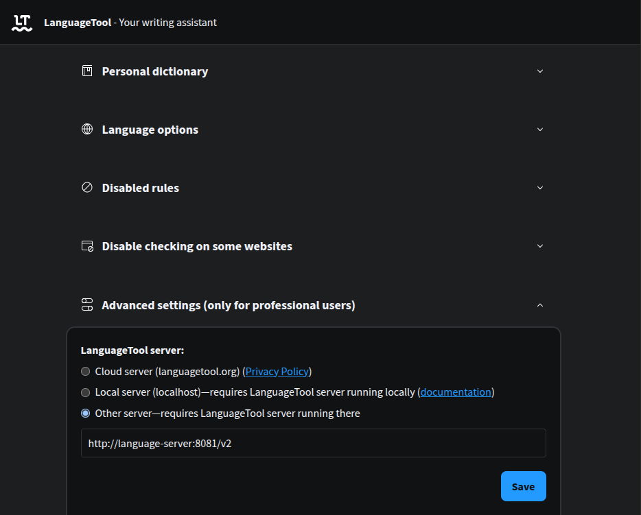
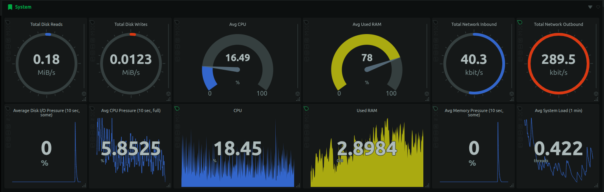
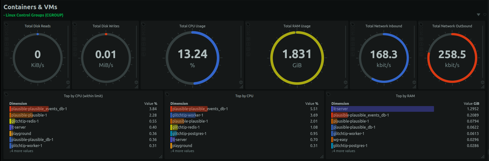

Last year (December 2025), [LanguageTool](https://languagetool.org/), a popular
open-source grammar checker,
[unfortunately decided to put its browser extension behind a premium subscription paywall](https://languagetool.org/webextension/premium-announcement).
While this decision is unfortunate, there is a workaround to use the browser
extension without paying: self-hosting the LanguageTool server. I set up one for
myself 3 months ago. It has been working well.

LanguageTool requires a server to process all grammar rules. It handles multiple
languages, consuming gigabytes of storage and RAM. Self-hosting means running
this server ourselves, and connecting our browser extensions to this server
instead of the official LanguageTool server. Even the official server no longer
accepts requests from browser extensions, our self-hosted server can.
Self-hosting allows us to use the browser extension without a subscription.

There are many online resources available on how to run the LanguageTool server
locally on localhost. In this blog post, I will instead demonstrate **how to run
it on a virtual private cloud server, enabling access from any of your devices,
anywhere**. Meanwhile, keeping the server unexposed to the public, only
accessible to my devices, with [Tailscale VPN](https://tailscale.com/). Finally,
I will share tips for optimizing the performance and resource usage, such as
loading n-gram data from a volume, using
[zram](https://docs.kernel.org/admin-guide/blockdev/zram.html) and a
[swap file](https://www.linux.com/news/all-about-linux-swap-space/) to increase
the available RAM, and using [Netdata](https://www.netdata.cloud/) to monitor
the server performance.

<!-- truncate -->

:::note

Self-hosting on a private cloud server requires some upfront effort to set up,
but this is a one-time process. It can save money in the long run, and offers
greater control over your data and privacy. While it requires some technical
knowledge, I tried to explain the following steps as simple as possible. If you
enjoy tinkering with computers and servers, this can be a rewarding project to
learn about self-hosting and server management!

:::

## Rent a server

A local LanguageTool server consumes local resources and storage, and is only
accessible when the server and the client are on the same network. To be able to
set up once and access anywhere, I deployed it on a virtual private cloud
server. For a discussion on the pros and cons of different self-hosting options
beyond virtual private cloud servers, feel free to check out
[my previous self-hosting blog post](./2025-05-25-self-host.md).

There are many cloud providers that offer virtual private servers, including the
big names like AWS EC2, Google Cloud Compute Engine, Azure Virtual Machines, or
more affordable options like DigitalOcean droplets or Hetzner cloud servers. I
personally use [Hetzner cloud servers](https://www.hetzner.com/cloud/), which I
found to be among the most affordable options.

I covered how I set up a Hetzner VPS in my previous
[self-hosting web server blog post](./2025-05-25-self-host.md), so I won't go
into details here. A configuration of 2vCPU and 4GB RAM is sufficient for
running the LanguageTool server. In fact, I am running this LanguageTool server
on the same cloud instance used in the previous post, demonstrating that
multiple web services can coexist without issues on a single virtual machine.

While my previous blog post involved setting up a web server, for this project,
the server only needs Docker. You can skip steps related to running the
databases or web servers, and any public exposure configurations written in the
previous blog. There is no need to rent a domain, configure Nginx, set up DNS
records, or obtain SSL certificates. An IPv4 address might not even be strictly
necessary if you rely solely on Tailscale, though I haven't tested this
configuration as my server requires one for other web services.

:::tip

If you would like to try Hetzner, here is my
[referral link for Hetzner](https://hetzner.cloud/?ref=YMRI7xo3b2af). You may
receive free credits upon sign-up.

:::

## Run with Docker

[LanguageTool documentation provides instructions for running the server locally](https://dev.languagetool.org/http-server).
However, instead of running it directly on the machine, I decided to run it in a
container. Containerizing the server simplifies dependency management and
reduces the likelihood of conflict when running multiple services on the same
machine.

Running it in Docker requires a Dockerfile. The following Dockerfile has
multiple stages, responsible for installing dependencies, downloading resources
and running the server respectively. Multi-stage builds results in a smaller and
more efficient final image. You can read about
[multi-stage builds in Docker documentation](https://docs.docker.com/build/building/multi-stage/).
The full Dockerfile is available at the end of this blog post.

First, we will start with a base image and install dependencies to build
[`fasttext`](https://github.com/facebookresearch/fastText), a library for text
classification that LanguageTool uses for better language detection. While
`fasttext` is optional according to the LanguageTool documentation, from my
experience, including it does not significantly increase resource usage and it
seems to provide better detection.

```dockerfile
# --- Stage 1: Build FastText ---
FROM debian:bullseye-slim AS fasttext-builder
RUN apt-get update && apt-get install -y \
    git \
    make \
    g++ \
    && rm -rf /var/lib/apt/lists/*

WORKDIR /build
RUN git clone https://github.com/facebookresearch/fastText.git && \
    cd fastText && \
    make
```

This stage uses `apt-get` to install tools to build `fasttext`, clones the
source code and uses `make` to build the `fasttext` binary.

Next, download the LanguageTool server and the `fasttext` model.

```dockerfile
# --- Stage 2: Fetch LanguageTool and Models ---
FROM alpine:latest AS fetcher
RUN apk add --no-cache wget unzip
WORKDIR /app

# Download and extract LanguageTool
RUN wget https://internal1.languagetool.org/snapshots/LanguageTool-latest-snapshot.zip && \
    unzip LanguageTool-latest-snapshot.zip && \
    rm LanguageTool-latest-snapshot.zip && \
    mv LanguageTool-*-SNAPSHOT lt

# Download FastText Model
RUN wget https://dl.fbaipublicfiles.com/fasttext/supervised-models/lid.176.bin
```

Note that the LanguageTool server version may change over time, so I renamed it
from `LanguageTool-*-SNAPSHOT` to `lt` for easier reference in the next stage.
`*` is a wildcard for the version number, e.g. `6.8`. When a new version is
released, simply rebuild the Docker image to use the new version.

Finally, create the final image that runs the LanguageTool server with the
`fasttext` model. The LanguageTool server requires a java runtime environment
(JRE). I use the `eclipse-temurin:17-jre` image as the base image for the final
stage because it is a Debian-based image pre-configured with Java 17 JRE, which
I found offers better compatibility with the LanguageTool server.

```dockerfile
# --- Stage 3: Final Runtime (Using Debian-based JRE for compatibility) ---
FROM eclipse-temurin:17-jre

# Set the working directory
WORKDIR /languagetool

# Copy LanguageTool from Stage 2
COPY --from=fetcher /app/lt ./

# Copy FastText Binary from Stage 1
COPY --from=fasttext-builder /build/fastText/fasttext ./fasttext

# Copy FastText Model from Stage 2
COPY --from=fetcher /app/lid.176.bin ./lid.176.bin

# Create server.properties with FastText paths
RUN echo "fasttextModel=/languagetool/lid.176.bin" > server.properties && \
    echo "fasttextBinary=/languagetool/fasttext" >> server.properties

# Ensure the fasttext binary is executable
RUN chmod +x /languagetool/fasttext

EXPOSE 8081

# Final command
CMD ["java", "-cp", "languagetool-server.jar", "org.languagetool.server.HTTPServer", "--config", "server.properties", "--port", "8081", "--allow-origin", "--public"]
```

The last stage copies the LanguageTool server, the `fasttext` binary and its
model into the image. Then, it creates a `server.properties` file that specifies
the paths to the `fasttext` binary and its model. Finally, it exposes port
`8081`, the port on which the LanguageTool server will run.

The command to run the server runs the `HTTPServer` class from the
`languagetool-server.jar` with the following options:

- `--config server.properties`: specifies the path to the configuration file
- `--port 8081`: specifies the port to run the server on
- `--allow-origin`: allows cross-origin requests, which is necessary for the
  browser extension to work
- `--public`: binds to `0.0.0.0` (all network interfaces) rather than
  `127.0.0.1` (localhost only). This is necessary for the server to be accessed
  from outside the container.

With this Dockerfile, we can build the image and run the container. In the
directory where the Dockerfile is located, run

```bash
docker build -t my-languagetool .
```

Once the image is built, run the container with

```bash
docker run -d -p 8081:8081 --name lt-server my-languagetool
```

In this command:

1. `-d ... my-languagetool`: Runs the `my-languagetool` image in detached mode
2. `-p 8081:8081`: Maps port `8081` of the container to port `8081` of the host
3. `--name lt-server`: Names the container `lt-server`

Verify the docker container is running with `docker ps`. You should see an
output like the following, indicating the status is "Up" and the ports are
correctly mapped.

```bash
$ docker ps
CONTAINER ID   IMAGE             COMMAND                  CREATED       STATUS       PORTS                                        NAMES
a343f1f87ea8   my-languagetool   "/__cacert_entrypoin…"   11 days ago   Up 11 days   0.0.0.0:8081->8081/tcp, [::]:8081->8081/tcp  lt-server
```

:::tip

Docker commands for managing the container:

- To stop the container, you can run `docker stop lt-server`
- To start it again, run `docker start lt-server`
- To see the logs of the container, run `docker logs lt-server`

To make it easier to manage the container, you can create a `build.sh` and
`run.sh` script to automate the build and run process. This way, you can simply
run `./build.sh` to build the image and `./run.sh` to run the container, without
having to remember the exact options used.

`build.sh`:

```sh
#!/bin/bash
docker build -t my-languagetool .
```

`run.sh`:

```sh
#!/bin/bash
docker run -d -p 8081:8081 --name lt-server my-languagetool
```

This `run.sh` script is for the initial setup. A more complete version,
including n-gram data configuration, is included at the end of the post.

Alternatively, you can also create a `docker-compose.yml` file to define the
service and use `docker-compose` to manage the container.

:::

Then, verify the server is running by sending a test request with `curl`:

```bash
curl "http://localhost:8081/v2/check?language=en-US&text=my+text"
```

You should receive a JSON response indicating grammar checking results.

<details>

<summary>If you have `jq` installed, you may use it to format the JSON output.</summary>

```bash
curl "http://localhost:8081/v2/check?language=en-US&text=my+text" | jq .
```

This is easier to read and gives you an insight of the response structure of the
LanguageTool server:

```json
{
  "software": {
    "name": "LanguageTool",
    "version": "6.8-SNAPSHOT",
    "buildDate": "2026-02-07 18:51:18 +0100",
    "apiVersion": 1,
    "premium": false,
    "premiumHint": "You might be missing errors only the Premium version can find. Contact us at support<at>languagetoolplus.com.",
    "status": ""
  },
  "warnings": {
    "incompleteResults": false
  },
  "language": {
    "name": "English (US)",
    "code": "en-US",
    "detectedLanguage": {
      "name": "English (US)",
      "code": "en-US",
      "confidence": 0.231,
      "source": "fasttext+commonwords"
    }
  },
  "matches": [
    {
      "message": "This sentence does not start with an uppercase letter.",
      "shortMessage": "Capitalization",
      "replacements": [
        {
          "value": "My"
        }
      ],
      "offset": 0,
      "length": 2,
      "context": {
        "text": "my text",
        "offset": 0,
        "length": 2
      },
      "sentence": "my text",
      "type": {
        "typeName": "Other"
      },
      "rule": {
        "id": "UPPERCASE_SENTENCE_START",
        "description": "Checks that a sentence starts with an uppercase letter",
        "issueType": "typographical",
        "urls": [
          {
            "value": "https://languagetool.org/insights/post/spelling-capital-letters/"
          }
        ],
        "category": {
          "id": "CASING",
          "name": "Capitalization"
        }
      },
      "ignoreForIncompleteSentence": true,
      "contextForSureMatch": -1
    }
  ],
  "sentenceRanges": [[0, 7]],
  "extendedSentenceRanges": [
    {
      "from": 0,
      "to": 7,
      "detectedLanguages": [
        {
          "language": "en",
          "rate": 1.0
        }
      ]
    }
  ]
}
```

</details>

Congratulations! You have successfully set up your own LanguageTool server with
Docker. In the next section, I will show how to set up Tailscale VPN to access
the server from anywhere without exposing this server to the public internet.

## Add Tailscale VPN

Now, the LanguageTool server is running, but it is only accessible from within
the cloud server itself. Next is to make it accessible to other devices, like
your laptop or desktop. We do not want to make the server public like in
[my previous self-hosting blog post](./2025-05-25-self-host.md), due to
potential traffic overload and security risks.

Instead, I used Tailscale VPN to create a private network connecting all my
devices and this cloud server. This private network allows all my devices to
access the LanguageTool server without exposing the server to the public
internet. Tailscale is surprisingly easy to set up and use. It is built on top
of Wireguard, a secure VPN protocol. The free tier is sufficient for this use
case. Create an account on the [Tailscale website](https://tailscale.com/), and
follow the instructions to install Tailscale on your machines.

Installing Tailscale on the server is just two commands and follow the output to
log in to your account:

```bash
curl -fsSL https://tailscale.com/install.sh | sh
sudo tailscale up
```

Once both the server and the local machine are connected to the Tailscale
network, you should see them listed in the Tailscale admin console. You can set
a name for the server, like "languagetool-server", so it is easier to reference
later.

You can test the connection locally by pinging the server's Tailscale IP address
or the name you set:

```bash
curl "http://languagetool-server:8081/v2/check?language=en-US&text=my+text"
```

The domain name, e.g. `languagetool-server` in this example, is the name of the
server in Tailscale. You should see the same JSON response as before, which
means you have successfully connected to the LanguageTool server through
Tailscale VPN!

If it doesn't work, isolate the issue by checking if it is a network issue or a
server issue. Try pinging the server to check if the connection is working:

```bash
ping languagetool-server -c 4
```

If ping works but the curl command doesn't, it is likely an issue with the
LanguageTool server. If ping doesn't work, it is likely a network issue. Check
the Tailscale admin console to see if both devices are listed and connected.

Once the curl command works, set the LanguageTool browser extension to point to
your Tailscale server. In Chrome:

1. Go to `chrome://extensions/` and find the LanguageTool extension
2. Click on "Details", and scroll down to "Extension options"
3. In the options page, scroll to the bottom and find "Advanced Settings"
4. In LanguageTool Server, select "Other server—requires LanguageTool server
   running there"
5. In the input box, enter the URL of your server with the Tailscale name or IP
   address, like `http://languagetool-server:8081/v2`, and save



Try opening a text area and see if the grammar checking works. You should see
the same grammar suggestions as before, but now it is powered by your own
server!

The URL should work for
[other LanguageTool extensions](https://dev.languagetool.org/software-that-supports-languagetool-as-a-plug-in-or-add-on.html).
I tested with both VS Code extension and Obsidian extension, both work with the
self-hosted server with the Tailscale URL.

## Add n-gram data

Loading n-gram data can further enhance detection accuracy.

An [n-gram](https://en.wikipedia.org/wiki/N-gram) is a contiguous sequence of
_n_ items from a given sample of text. In natural language processing, n-grams
can capture information about common phrases, word orders and collocations.
Basically, it tracks what words commonly appear together in a language together.
[LanguageTool can use n-gram data to improve the detection of grammar errors](https://dev.languagetool.org/finding-errors-using-n-gram-data),
especially for errors that involve word order or common phrases. For example, it
can help distinguish between "there" and "their", "put on the breaks" v.s. "put
on the brakes".
[See the documentation](https://dev.languagetool.org/finding-errors-using-n-gram-data#background)
for more explanation. LanguageTool supports multiple languages: `en`, `de`,
`es`, `fr` and `nl` and you can find them
[here](https://languagetool.org/download/ngram-data/).

The n-gram data is optional. It can significantly improve the detection of
certain types of errors, but it uses significantly more RAM and storage. One
advantage of renting a private cloud server instead of running it locally is to
support n-gram detection. For English alone, the compressed zip file is more
than 8GB and the unzipped n-gram data is over 15GB.

Make sure your server has enough storage to download and unzip the n-gram data.
If not, you can rent a volume and attach it to the server. The volumes in
Hetzner are SSD-based, making them sufficiently fast for this use case. HDD
volumes are not recommended because the n-gram data is accessed frequently,
which will be slow on HDDs. I personally use a 16GB volume, by downloading the
zip file to the home directory, then unzipping it to the volume.

If you opt to add a volume, ensure you change the ownership of the n-gram data
folder to the user that the Docker container runs as, allowing it access. You
can do this with the following command:

```bash
# sudo chown -R <user>:<user> <path to volume>
sudo chown -R ethan:ethan /mnt/HC_Volume_id/
```

Then, download and unzip the n-gram data.

```bash
wget -c https://languagetool.org/download/ngram-data/ngrams-en-20150817.zip

# Change the path here to the path where you want to unzip the n-gram data
unzip ngrams-en-20150817.zip -d /mnt/HC_Volume_id/language-tool-ngrams/
```

After unzipping, you should see a folder named `en` inside the
`language-tool-ngrams` folder, which contains the n-gram data for English. You
can repeat the same process for other languages if you want to use n-gram
detection for them.

:::tip

Using `wget -c` allows the download to be resumed if it is interrupted, which is
very useful for large files.

:::

To use the n-gram data, you need to change the Dockerfile to read the n-gram
data and the run command to bind the n-gram data folder to the container.

In the Dockerfile, add the following lines to the `server.properties` file:

```dockerfile
RUN echo "fasttextModel=/languagetool/lid.176.bin" > server.properties && \
    echo "fasttextBinary=/languagetool/fasttext" >> server.properties && \
    echo "languageModel=/ngrams" >> server.properties

# Ensure the fasttext binary is executable
RUN chmod +x /languagetool/fasttext

# Create the mount point directory
RUN mkdir /ngrams
```

Then change the `docker run` command, if you are using a `run.sh` script:

```bash
#!/bin/bash

# Change the path here to the path where you unzipped the n-gram data
NGRAM_PATH="/mnt/HC_Volume_id/language-tool-ngrams"

docker run -d \
  -p 8081:8081 \
  --name lt-server \
  -v "$NGRAM_PATH:/ngrams:ro" \
  -e JAVA_OPTS="-Xms512m -Xmx2g" \
  my-languagetool
```

- `-v "$NGRAM_PATH:/ngrams:ro"`: Mounts the n-gram data folder from the host to
  the container at `/ngrams` in read-only mode (`:ro`)
- `-e JAVA_OPTS="-Xms512m -Xmx2g"`: Sets the initial and maximum heap size for
  the Java process to minimum 512MB and maximum 2GB

Rebuild and rerun the container with the new configuration:

```bash
./build.sh
docker stop lt-server && docker rm lt-server && ./run.sh
```

You can test if the n-gram detection is working by typing "Don’t forget to put
on the **breaks**". It should suggest replacing "breaks" with "brakes". If it
works, congratulations! You have successfully set up the n-gram data for better
detection.

Next, I will share some tips for optimizing the performance and resource usage
of the server, including using `zram` and swap file to increase the available
RAM, and using Netdata to monitor the server performance and resource usage.

## Debugging and optimization tips

Some commonly used commands and tools while I was debugging and optimizing the
server:

### Docker related

`docker ps -a`

- Check if the container is running and the ports are correctly mapped
- If the container exited, use `docker inspect` to check if it is because of
  running out of memory (OOMKilled)

`docker logs lt-server`

- Check the logs of the container for any errors
- Search for keywords like "error" or "exception"
- Search if the error messages are posted in any forums
- Provide the full logs to AI assistant sometimes can identify the issue and
  suggest a solution

`docker inspect lt-server --format='{{json .State}}'`

- Check the container configuration
- If your container exited unexpectedly, look for `"OOMKilled": true` which
  indicates the container was killed because it ran out of memory

### Add `zram`

[`zram`](https://docs.kernel.org/admin-guide/blockdev/zram.html) is a Linux
kernel module that provides a compressed block device in RAM. The trade-off for
`zram` is that it uses CPU resources to compress and decompress data in RAM to
virtually increase the available RAM. For a server running memory-intensive but
not CPU-intensive applications, `zram` can be a good option to increase the
effective RAM without hardware upgrades. This is especially useful for the
LanguageTool server, which can consume significant memory when processing large
texts or using n-gram data.

Install the `zram` tool:

```bash
sudo apt update
sudo apt install zram-tools
```

It usually starts automatically with the default settings. Check the config file
at `/etc/default/zramswap`. Here is my configuration:

```bash
# Compression algorithm selection
# speed: lz4 > zstd > lzo
# compression: zstd > lzo > lz4
# This is not inclusive of all that is available in latest kernels
# See /sys/block/zram0/comp_algorithm (when zram module is loaded) to see
# what is currently set and available for your kernel[1]
# [1]  https://github.com/torvalds/linux/blob/master/Documentation/blockdev/zram.txt#L86
ALGO=zstd

# Specifies the amount of RAM that should be used for zram
# based on a percentage the total amount of available memory
# This takes precedence and overrides SIZE below
PERCENT=60

# Specifies the priority for the swap devices, see swapon(2)
# for more details. Higher number = higher priority
# This should probably be higher than hdd/ssd swaps.
PRIORITY=100
```

Restart the `zram` service to apply the changes:

```bash
sudo systemctl enable zramswap
sudo systemctl start zramswap
```

Verify that `zram` is working by checking the service is running:

```bash
$ sudo systemctl status zramswap.service
● zramswap.service - Linux zramswap setup
     Loaded: loaded (/usr/lib/systemd/system/zramswap.service; enabled; preset: enabled)
     Active: active (exited) since Tue 2026-02-03 16:17:39 UTC; 2 weeks 4 days ago
       Docs: man:zramswap(8)
   Main PID: 17500 (code=exited, status=0/SUCCESS)
        CPU: 47ms
```

You should see new swap is available too:

```bash
$ swapon --show
NAME       TYPE      SIZE   USED PRIO
/dev/zram0 partition 2.2G   1.8G  100
```

If you cannot see the zram device, check if the system needs to be updated. You
might see messages like "Pending kernel upgrade!" or "Service restarts being
deferred" in the output of `sudo apt update`. If so, the server needs to be
rebooted (`sudo reboot`). But before that, ensure docker automatically restarts
containers after reboot by:

```bash
# Set the restart policy for all containers to "unless-stopped"
docker update --restart unless-stopped $(docker ps -q)

# Verify services are automatically restarted after reboot
sudo systemctl is-enabled docker
sudo systemctl is-enabled nginx
```

If `zram` still doesn't work after reboot, check the `journalctl` for any
errors:

```bash
sudo journalctl -xeu zramswap.service
```

For me, I hit an error where the `zram` module is not found:

```bash
zramswap[9849]: modprobe: FATAL: Module zram not found in directory /lib/modules/6.8.0-94-generic
systemd[1]: zramswap.service: Main process exited, code=exited, status=1/FAILURE
```

The problem is the Linux kernel module for `zram` is missing from the system
kernel directory. It is likely due to optimized virtual kernels used in Hetzner
cloud servers. Hetzner probably stripped out non-essential modules to save space
and improve boot time.

The following command installed the `zram` module that matches the version of
the current kernel:

```bash
sudo apt update
sudo apt install linux-modules-extra-$(uname -r)
```

After installing the missing modules, manually load the `zram` module and start
the `zramswap` service:

```bash
sudo modprobe zram
sudo systemctl start zramswap
```

After that we can verify again with `swapon --show`, and we should see the
`zram` device is available.

### Add swap file

`zram` uses CPU to compress and decompress data in RAM, but that data is still
stored in RAM. Swap file, on the other hand, uses disk space to provide
additional virtual memory when the RAM is exhausted. It is much slower than RAM,
but it can prevent the system from crashing when it runs out of memory. For
memory-intensive applications, a swap file increases available memory and can
improve system stability.

My server has 4GB of RAM. I added a 4GB swap file to effectively double the
available memory. You can adjust the size of the swap file based on your needs
and the available disk space.

```bash
# 1. Create a 4GB file for swap
sudo fallocate -l 4G /swapfile

# 2. Secure the file (only root should read/write)
sudo chmod 600 /swapfile

# 3. Set up the swap area
sudo mkswap /swapfile

# 4. Enable the swap
sudo swapon /swapfile

# 5. Make it permanent (so it survives a reboot)
echo '/swapfile none swap sw 0 0' | sudo tee -a /etc/fstab
```

To verify it works, use `swapon --show` to see the available swap:

```bash
$ swapon --show
NAME       TYPE      SIZE   USED PRIO
/swapfile  file        4G 299.5M   -2
/dev/zram0 partition 2.2G   1.9G  100
```

Notice that the `zram` device has a higher priority than the swap file, which
means the system will use the `zram` memory first before using the swap file.
This way, we can benefit from the faster `zram` memory, and only use the slower
swap file when the `zram` memory is fully utilized.

### Avoid running out of disk space

Running out of disk space can cause the server to crash and the container to
exit unexpectedly. You might even experience issues connecting to the server via
SSH if the system cannot write to logs. To avoid this, you can reserve some disk
space by creating a large file that takes up space, and delete it when you need
more space.

```bash
# Create a 1GB file to reserve space
truncate -s 1G ~/random-to-avoid-disk-is-full.txt
```

When you need more space, delete the file or reduce its size:

```bash
# Delete the file to free up space
rm ~/random-to-avoid-disk-is-full.txt

# Change it to a smaller size like 500MB
truncate -s 500M ~/random-to-avoid-disk-is-full.txt
```

### Monitor with netdata

As introduced in the previous
[self-hosting blog post](./2025-05-25-self-host.md#netdata), I use
[Netdata](https://www.netdata.cloud/) for monitoring the Hetzner server and the
containers. It uses an agent to read the data and optionally upload to Netdata
cloud server for some nice visualizations. It includes basics like CPU, memory,
storage and network data for the host machine. Additionally, it can also show
the load for each container running in the machine.



I can monitor the CPU and memory usage of each container. As shown below, the
LanguageToolServer consumes over 1GB of memory.



Create an account on Netdata Cloud, follow the prompt to connect a node, pick
Ubuntu and follow the instructions on screen to install the Netdata agent and
all graphs worked. Email automations are automatically configured to notify when
things went wrong. However, configuring the notifications rules requires
subscribing to a paid plan.

:::tip

If you would like to subscribe to Netdata, here is my
[invite link](https://netdata.cello.so/m3g8ZJvzrI9) for 10% discount for the
first year.

:::

## Conclusion

This blog post shows how to self-host the LanguageTool server for the browser
extension, so we can continue using the extension without paying for the
subscription fee. Self-hosting the server offers greater control over our data
and privacy. We are not sending all text we typed to the official server any
more.

The LanguageTool server runs in a docker container, on a virtual private cloud
server. Devices can access the server securely through Tailscale VPN, without
exposing the server to the public. We can also optimize the performance and
resource usage by loading n-gram data from volume, using `zram` and swap file to
increase the available RAM, and using Netdata to monitor the server performance
and resource usage.

## References

- [LanguageTool HTTP Server Documentation](https://dev.languagetool.org/http-server)
- [LanguageTool N-gram Data Documentation](https://dev.languagetool.org/finding-errors-using-n-gram-data)

The full Dockerfile:

```dockerfile
# --- Stage 1: Build FastText ---
FROM debian:bullseye-slim AS fasttext-builder
RUN apt-get update && apt-get install -y \
    git \
    make \
    g++ \
    && rm -rf /var/lib/apt/lists/*

WORKDIR /build
RUN git clone https://github.com/facebookresearch/fastText.git && \
    cd fastText && \
    make

# --- Stage 2: Fetch LanguageTool and Models ---
FROM alpine:latest AS fetcher
RUN apk add --no-cache wget unzip
WORKDIR /app

# Download and extract LanguageTool
RUN wget https://internal1.languagetool.org/snapshots/LanguageTool-latest-snapshot.zip && \
    unzip LanguageTool-latest-snapshot.zip && \
    rm LanguageTool-latest-snapshot.zip && \
    mv LanguageTool-*-SNAPSHOT lt

# Download FastText Model
RUN wget https://dl.fbaipublicfiles.com/fasttext/supervised-models/lid.176.bin

# --- Stage 3: Final Runtime (Using Debian-based JRE for compatibility) ---
FROM eclipse-temurin:17-jre

# Set the working directory
WORKDIR /languagetool

# Copy LanguageTool from Stage 2
COPY --from=fetcher /app/lt ./

# Copy FastText Binary from Stage 1
COPY --from=fasttext-builder /build/fastText/fasttext ./fasttext

# Copy FastText Model from Stage 2
COPY --from=fetcher /app/lid.176.bin ./lid.176.bin

# Create server.properties with FastText paths
RUN echo "fasttextModel=/languagetool/lid.176.bin" > server.properties && \
    echo "fasttextBinary=/languagetool/fasttext" >> server.properties && \
    echo "languageModel=/ngrams" >> server.properties

# Ensure the fasttext binary is executable
RUN chmod +x /languagetool/fasttext

# Create the mount point directory
RUN mkdir /ngrams

EXPOSE 8081

# Final command
CMD ["java", "-cp", "languagetool-server.jar", "org.languagetool.server.HTTPServer", "--config", "server.properties", "--port", "8081", "--allow-origin", "--public"]
```

`build.sh`:

```bash
#!/bin/bash

docker build -t my-languagetool .
```

`run.sh`:

```bash
#!/bin/bash

# Change the path here to the path where you unzipped the n-gram data
NGRAM_PATH="/mnt/HC_Volume_id/language-tool-ngrams"

docker run -d \
  -p 8081:8081 \
  --name lt-server \
  -v "$NGRAM_PATH:/ngrams:ro" \
  -e JAVA_OPTS="-Xms512m -Xmx2g" \
  my-languagetool
```
